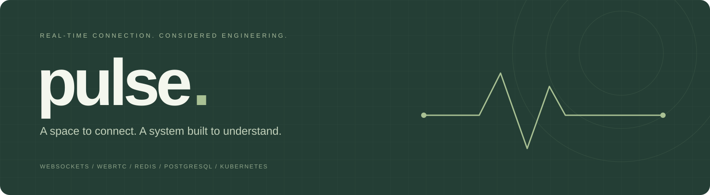
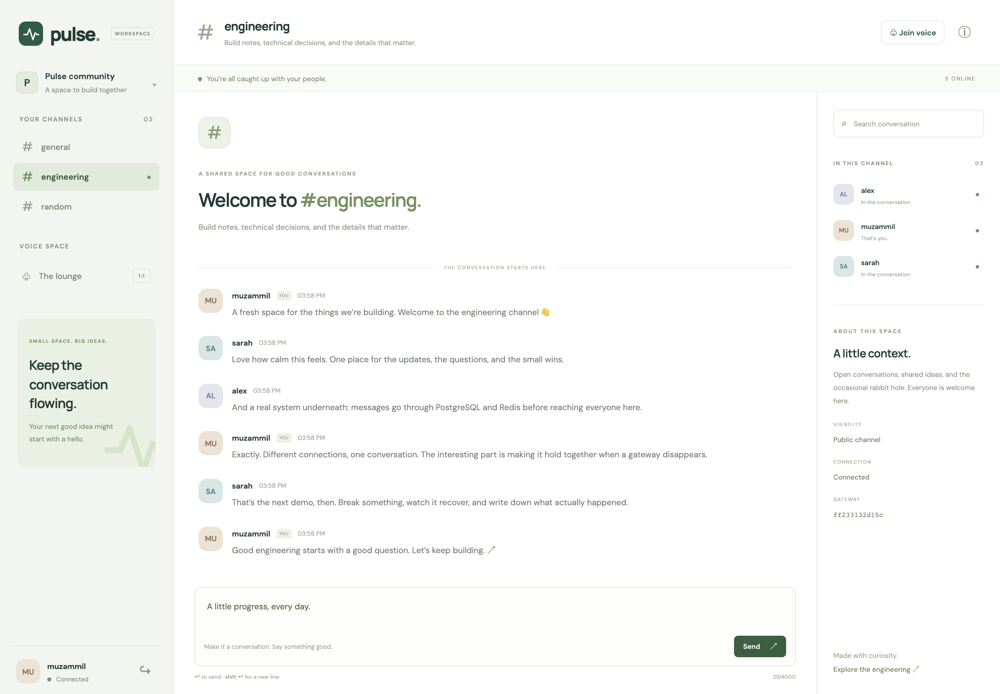
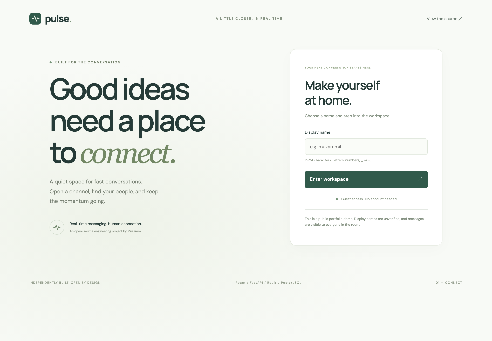
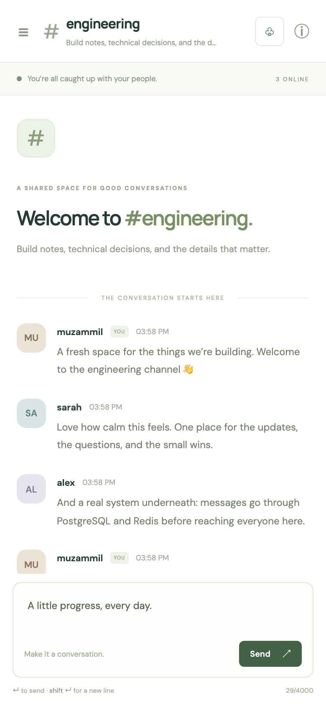
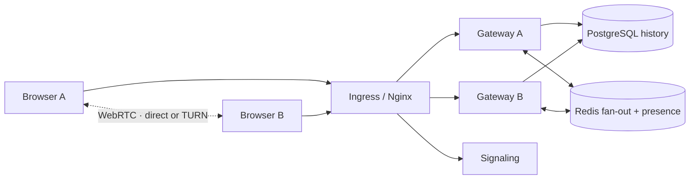
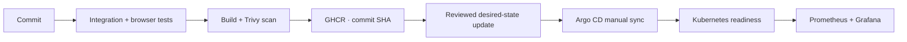
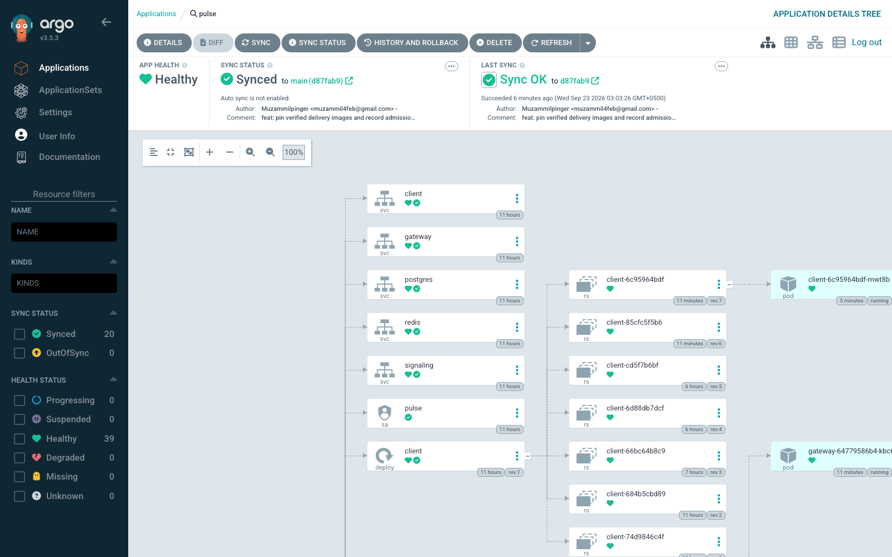
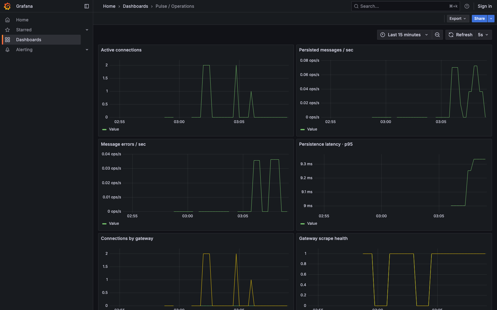

<p align="center"></p>

<p align="center">
  <a href="https://github.com/Muzammilpinger/Pulse/actions/workflows/ci.yml"></a>
  <a href="https://github.com/Muzammilpinger/Pulse/releases"></a>
  
</p>

<p align="center"><strong>A calm place to talk. A distributed system you can inspect.</strong><br>
Public channels, durable chat, shared presence, and two-person voice — with measured failure recovery and a working delivery pipeline.</p>

<p align="center"><a href="#run-it">Run it</a> · <a href="docs/CASE_STUDY.md">Engineering story</a> · <a href="docs/LOAD_TEST_RESULTS.md">Measurements</a> · <a href="docs/DEMO.md">Walkthrough</a> · <a href="docs/RUNBOOK.md">Operations</a></p>



## The thirty-second version

Pulse explores what happens after a chat app grows beyond one server. Browsers can connect to different FastAPI gateways and still share a conversation. PostgreSQL stores history; Redis distributes live events and maintains expiring presence. React reconnects, merges history, and offers a separate WebRTC voice lounge.

The portfolio includes the infrastructure **and its evidence**: tested containers, immutable GHCR images, Helm, Argo CD, network boundaries, monitoring, load measurements, and controlled failures. This is a local engineering demo with signed guest sessions, not a hosted commercial service.

## Run it

Install Docker with Compose, then:

```sh
git clone https://github.com/Muzammilpinger/Pulse.git
cd Pulse
docker compose up -d --build --wait
```

Open **[localhost:8085](http://localhost:8085)**. Pick a display name. Open an incognito window as a second guest and send a message. Voice needs microphone permission and two guests in the same channel. TURN is optional for local direct calls; follow the [voice setup](docs/VOICE.md) for forced relay.

All published ports bind to localhost. Two gateways run by default; PostgreSQL and Redis have no host ports. `docker compose stop` preserves chat history.

<details>
<summary><strong>Run the checks yourself</strong></summary>

```sh
python3 -m venv .venv
.venv/bin/pip install -r tests/requirements.txt
.venv/bin/pytest -q tests
cd client
npm ci
npx playwright install chromium
npm test
```

The backend tests use real PostgreSQL, Redis, and independent gateway ports. Browser tests cover chat, history, channel isolation, mobile input, safe text rendering, and two-peer WebRTC with synthetic microphones. See [the runbook](docs/RUNBOOK.md) for Kubernetes and failure experiments.

</details>

<details>
<summary><strong>Welcome screen and mobile view</strong></summary>


<p align="center"></p>

</details>

**Watch:** [2-minute walkthrough](https://github.com/Muzammilpinger/Pulse/releases/download/v3.0.0/pulse-walkthrough.mp4) · [45-second clip](https://github.com/Muzammilpinger/Pulse/releases/download/v3.0.0/pulse-short.mp4) · [Live scaling](https://github.com/Muzammilpinger/Pulse/releases/download/v3.0.0/pulse-scaling.mp4) · [Gateway recovery](https://github.com/Muzammilpinger/Pulse/releases/download/v3.0.0/pulse-recovery.mp4)

## Small product, visible engineering

| In the workspace | Underneath |
|---|---|
| Public channels and durable history | PostgreSQL commit before Redis publication; canonical message IDs |
| Online members across replicas | Per-connection presence leases; multiple tabs handled independently |
| Reconnection and older messages | ID-based history merge, recent catch-up, cursor pagination |
| Two-person audio, mute, explicit rejoin | Bounded signaling, queued ICE, direct or TURN-relayed media |
| Desktop and mobile layouts | Keyboard message input, search over loaded messages, connection feedback |



[Architecture and delivery semantics](docs/ARCHITECTURE.md) · [Decision records](docs/adr) · [Threat model](docs/THREAT_MODEL.md)

## Evidence, with boundaries

| Check | Observed result | Inspect |
|---|---|---|
| Cross-instance fan-out | 100 clients received all 1,000 expected deliveries; p95 21.16 ms | [Load report](docs/LOAD_TEST_RESULTS.md) |
| Autoscaling mechanics | 80 sockets, 92,800 deliveries, zero recorded errors; 2 → 4 → 5 gateways | [HPA observation](docs/evidence/hpa-scaling.json) |
| Gateway replacement | Browser reconnected in 7.878 s, retained history, sent again | [Recovery observation](docs/evidence/gateway-recovery.json) |
| Forced TURN | Both local peers selected relay candidates and received media bytes | [ICE evidence](docs/evidence/turn-relay.json) |
| Delivery pipeline | Tests, scans, and multi-architecture publication passed | [Recorded CI run](https://github.com/Muzammilpinger/Pulse/actions/runs/35790737059) |
| GitOps repair | Broken replacement image failed; two gateways stayed ready; Git revision restored | [Rollout observation](docs/evidence/gitops-rollback.json) |
| Security boundaries | Denied secret access and forbidden network path; invalid resource policy rejected | [Evidence directory](docs/evidence) |
| Monitoring | Real gateway-down alert fired and cleared after restoration | [Alert observation](docs/evidence/monitoring-alert.json) |

These are **local, bounded experiments**, not a throughput ceiling, uptime promise, or internet latency benchmark. The first HPA attempt did not scale because metrics were unavailable; [that failed observation is retained](docs/evidence/hpa-unavailable.json). Short fan-out runs were repeated rather than presenting one favorable number as capacity.

## From commit to running pods





The [Helm chart](deploy/helm/pulse) includes resource limits, probes, a disruption budget, restricted workloads, default-deny policies, and optional HPA. [GitOps values](deploy/helm/pulse/values-gitops.yaml) pin a verified image revision. Desired state lives in this repository so the demo has one auditable source. The [local addon installer](scripts/addons-up.sh) pins Argo CD, Traefik, Kyverno, metrics-server, and Sealed Secrets versions.



```sh
docker compose -f docker-compose.yml -f docker-compose.monitoring.yml up -d
# Grafana: http://localhost:3000/d/pulse-operations
```

## What this release does not promise

- **Identity:** display names are unverified guest aliases; channels are public. Sessions expire, but established sockets are not periodically reauthenticated.
- **Delivery:** Redis Pub/Sub cannot replay events. A crash between database commit and publication can leave a message visible only in history. No exactly-once guarantee.
- **High availability:** PostgreSQL, Redis, and signaling are single-instance demo services. Signaling restarts end calls. Local storage is not database HA.
- **Voice quality:** automated tests use synthetic microphones and local networks. TURN evidence does not prove every real-world NAT path. Voice outcome counters are untrusted browser reports, counted per peer.
- **Operations:** local demo credentials, loopback ports, no public hosting, no alert notification destination. The image gate covers fixable critical findings at scan time, not all vulnerabilities forever.

Future work is deliberately separate: verified accounts, private-room authorization, a transactional outbox, idempotent sends, database migrations/backups/HA, short-lived TURN credentials, multi-network voice testing, and richer abuse controls. Video, screen sharing, mobile apps, and an SFU are outside v3.0.

## Explore the repository

| Path | Purpose |
|---|---|
| [`client/`](client) | React workspace and browser tests |
| [`gateway/`](gateway) | Chat, history, sessions, presence, and metrics |
| [`signaling/`](signaling) | Two-peer WebRTC coordination |
| [`deploy/`](deploy) | Compose monitoring, Helm, kind, Argo CD, policies |
| [`scripts/`](scripts) | Reproducible measurements, fault experiments, screenshots |
| [`docs/evidence/`](docs/evidence) | Actual recorded outputs and explicit test scope |

[Case study](docs/CASE_STUDY.md) · [Release checklist](docs/RELEASE_CHECKLIST.md) · [Changelog](CHANGELOG.md) · [Contributing](CONTRIBUTING.md)

<sub>Sample conversations are presentation fixtures created through the real API. Screenshots show the running application. The original v1.0.0 tag is preserved; later work is committed with its actual dates.</sub>
