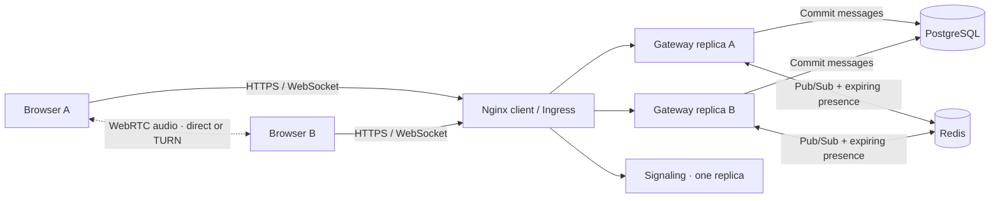

# Architecture

Pulse is a deliberately small distributed system: stateless HTTP handling, stateful WebSocket connections, ephemeral Redis coordination, durable PostgreSQL history, and a separate two-peer voice signaling service.

## Message lifecycle

1. A browser requests a signed, one-hour guest session. Display names are unverified public aliases, not accounts.
2. Its WebSocket connects to one gateway. A socket remains attached to that gateway for its lifetime; no affinity is required.
3. The gateway validates room, origin, session, message length, and the shared per-alias rate limit.
4. PostgreSQL commits the message and assigns an integer ID and UTC timestamp.
5. Redis publishes that canonical event. Every gateway's subscriber fans it out to its own local clients in the room.
6. On connection or reconnection, the client retrieves the latest 50 persisted messages, merges by ID, and offers older-history pagination.

**Delivery semantics:** persistence precedes publication. A crash between commit and publish can produce a message visible in history but absent from live fan-out. Redis Pub/Sub does not replay missed events. Reconnecting catches up the latest 50; larger gaps require loading earlier history. This is not exactly-once delivery, and retries by a person can create duplicate messages. An outbox and client-generated idempotency keys are explicit future work.

## Shared presence

A Redis sorted set per room stores `alias:connection-id` with an expiry timestamp. Every connection refreshes its lease every 10 seconds; leases expire after 35 seconds. Each browser receives a room presence snapshot on that cadence. Multiple tabs retain independent leases, so closing one does not make the other disappear. Crashed gateways leave leases that naturally expire. Empty/inactive keys expire after 70 seconds.

## Voice

The signaling service admits exactly two sockets per room. The first peer offers only after the second joins, preventing lost early offers and offer collisions. SDP and ICE pass over WebSockets; audio goes directly between browsers or through a configured coturn server. The browser buffers ICE candidates until a remote description is installed, exposes microphone errors, and stops tracks on exit.

Signaling is intentionally **one replica**. Its room membership is process-local; scaling it without shared signaling state would break calls. A restart ends negotiations, and users explicitly rejoin. The signaling deployment uses Recreate to avoid splitting the in-memory room registry across overlapping pods. Deployment ends calls; active-call continuity is not guaranteed.

## Operations

Compose starts two gateways with separate host ports for deterministic cross-instance testing. Kubernetes uses two gateway replicas, independent readiness/liveness/startup probes, a disruption budget, bounded resources, a non-root service account without API credentials, and optional CPU HPA. CPU is a starting metric, not a proxy for idle socket capacity.

The PostgreSQL StatefulSet is single-node storage for a demo. Redis is disposable. Neither is highly available. The schema is created under a PostgreSQL advisory lock on startup; future schema changes require a migration tool and a backwards-compatible rollout.

Prometheus measures connections, persisted messages, errors, and persistence duration. The supplied Grafana dashboard displays the actual scraped values. No user or room labels are attached to metrics, keeping cardinality bounded.

## Source references

- [Kubernetes network policies](https://kubernetes.io/docs/concepts/services-networking/network-policies/): policy resources require an enforcing network plugin.
- [Prometheus histograms](https://prometheus.io/docs/practices/histograms/): latency panels use histogram bucket rates and `histogram_quantile`.
- [FastAPI release notes](https://fastapi.tiangolo.com/release-notes/): backend dependencies are pinned to explicit releases.

Voice outcome counters record `connected` and `failed` reports from each browser peer, at most once per outcome per signaling connection. They are low-cardinality, untrusted client telemetry, not a count of unique calls or a server-side proof of media quality. They reset when signaling restarts.
